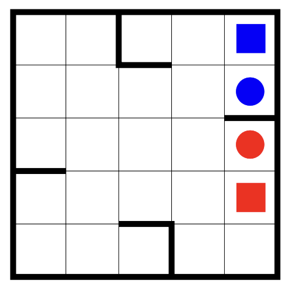

# Rolling Balls Puzzle

_Homework Project by Keve Lajsz_

#### Description

We placed a red and a blue ball on the board shown in **Figure 37**. The board can be tilted along
all
four sides, allowing the balls to move naturally until they collide with the thick walls marked on
the diagram. The objective is to guide the blue ball to the square marked with blue and the red ball
to the square marked with red. The board can only be tilted in a specific direction if the balls do
not collide while in motion.

---

<!--suppress CheckImageSize -->

<em>Figure 37</em>
  

Ha szeretnéd magadnak futtatni, a következők kellenek: local PostgreSQL adatbázis **vagy** a
Debreceni Egyetem CODD Oracle szerveréhez elérés. Az utóbbi esetében a következő környezeti
változókkal kell dolgozni:
 - **CODD_USER**: CODD-ba a felhasználóneved, általában a Neptun kód előtte egy "u_"-val, pl. "u_abc123"
 - **CODD_PASS**: jelszavad a CODD-hoz
